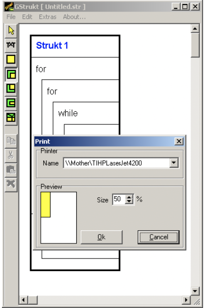

# GStrukt

## Introduction 

This project was my final project I did in high school.
The purpose of it to enable the user to draw Nassi-Shneiderman-Diagramm (https://de.wikipedia.org/wiki/Nassi-Shneiderman-Diagramm).
Why did I choose this kind of project? I liked programming and I was annoyed that there was no true intuitive Software on the Market that enabled me to do this without learning the complicated and un-intuitive programs available at that time.

How does it look like? 

I learned a lot by creating this piece of software (first realworld use of Recursion), which was still used actively in the High school many years.

Still remembering that there was a bug when using too many 'if' conditions combinend with other structures ^^, never figured out, challenge for you? ;)

## Enjoy
